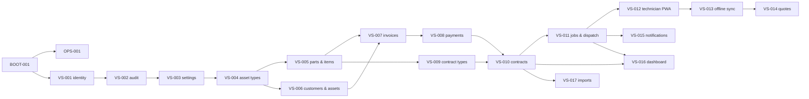

# allamc.in — Engineering Plan v1.0

**Owns:** WHAT to build and in WHAT ORDER. HOW is owned by `CLAUDE.md`/`AGENTS.md`; guarantees by
`scripts/verify.sh`, import-linter, CI, RLS and DB triggers. Schema, enums, state machines and invariants
are in `DATA-001-data-contract.md`; screens in `PRODUCT_EXPERIENCE_SPEC.md`; rationale in
`PRODUCT_DECISIONS.md` (D-xx references below).

## 1. Product in one paragraph

allamc.in is a multi-tenant SaaS for businesses that sell and service Annual Maintenance Contracts (AMCs)
on any kind of equipment. A tenant configures its own asset types, checklists and contract coverage
rules; sells contracts; runs preventive and breakdown service with an offline-capable technician PWA;
bills with full GST compliance; and tracks parts, purchasing, receivables and renewals. Later tracks add
OEM service-centre features, a consumer app across providers, and a marketplace (D-01…D-05).

## 2. Release tracks

| Track | Goal | Slices | Exit criterion |
|---|---|---|---|
| **MVP-1** | First paying independent service businesses | BOOT-001, OPS-001, VS-001…VS-017 | Track DoD in `DEFINITION_OF_DONE.md`; 3 design-partner tenants live on staging data for 2 weeks |
| **MVP-2** | Mid-size businesses; self-serve growth | VS-018…VS-030 | Track DoD; free plan + paid subscriptions live |
| **T2 — OEM** | OEM-authorised service centres | VS-031…VS-035 | PLAN-GATE: detail after OEM interviews (D-53) |
| **T3 — Customer app** | Consumers track all their AMCs | VS-036…VS-039 | PLAN-GATE |
| **T4 — Marketplace** | Discover & buy AMCs online | VS-040…VS-044 | PLAN-GATE: CA + payments review (D-05) |

**PLAN-GATE:** a track marked PLAN-GATE must be expanded to the same level of detail as MVP-1 (stories,
acceptance, failure paths, screens, DATA-001 additions) and approved before any of its slices start.
Agents must not build a PLAN-GATE slice from its outline.

## 3. Slice format

Every slice below states: **Module** · **Depends on** · **UI** (YES with screen IDs from the Product
Experience Spec, or NO) · **Stories** · **Acceptance** · **Failure paths** (tests that must exist) ·
**Invariants** that apply (TEN tenancy, AUD audit, LCK locking, MNY money, CFG config, IDM idempotency,
VER immutable versions, DOC immutable documents, PII) · **Config** keys read.

## 4. Dependency order (MVP-1)

---

## 5. MVP-1 slices

### BOOT-001 — Repository bootstrap & green baseline
- **Module:** repo-wide · **Depends on:** — · **UI:** YES — app shell only (SCR-SHELL-01)
- **Stories:**
  - Create the monorepo layout from `docs/stack-python-react-gcp.md`: `backend/` (uv, FastAPI, SQLAlchemy,
    Alembic, Pydantic, Procrastinate, pytest, ruff, mypy, import-linter) and `frontend/` (Vite, React, TS,
    Tailwind with `docs/design-tokens.json`, TanStack Query, react-i18next, Dexie, vite-plugin-pwa,
    Vitest, Playwright, ESLint).
  - Create **empty packages for every MVP module** so `backend/.importlinter` resolves.
  - `app/common/`: `errors.py` (ErrorCode enum + AppError + exception handler returning
    `{code, message_key, details}`), `money.py` (see ADR-0003 and `docs/templates/money_reference.py`),
    `db.py` (engines for owner/app roles, `tenant_session()`), `config.py` (`require_*` API over
    `config_value`, DEV_TEST seed loader), `ids.py` (UUIDv7), `clock.py` (injectable clock, IST display).
  - `app/ports/` package with `AuditPort` Protocol (implementation arrives in VS-002; BOOT provides a
    test double) and `app/wiring.py` composition root.
  - First Alembic revision: roles grants (`allamc_app`), `processed_command`, `config_value`, the RLS
    helper function `app_current_tenant()`; `docker-compose.yml` for local Postgres.
  - Frontend shell: responsive layout (bottom nav < 768 px, side nav ≥ 768 px), theme tokens, en/hi
    switch, offline indicator, error-code → i18n mapping, `Paise` type + `formatPaise()`.
  - Install `docs/templates/test_architecture.py` as `backend/tests/architecture/` and
    `docs/templates/test_money_reference.py` under `backend/tests/unit/common/`; provide what they need:
    `app.common.db.Base`, `app.wiring.import_all_models()`, and the `owner_conn`, `app_conn`,
    `seeded_two_tenants` fixtures in `tests/conftest.py`, plus the generic cross-tenant harness stub.
- **Acceptance:** `bash scripts/verify.sh` green from a clean checkout with `docker compose up -d` +
  `alembic upgrade head`; the shell renders at 360 px and 1280 px in en and hi.
- **Failure paths:** architecture test fails when a fake tenant table lacks RLS (test the test);
  money helper rounding table (half-up), refusal on float input; `config.require_*` raises
  `CONFIG_NOT_SET` when missing.
- **Invariants:** all established here. **Config:** DEV_TEST seed only.

### OPS-001 — Staging & production on GCP
- **Module:** infra · **Depends on:** BOOT-001 · **UI:** NO
- **Stories:** Cloud Run services `api` and `worker` (same image, different command); Cloud SQL Postgres 16
  (private IP, PITR on, owner and `allamc_app` users in Secret Manager); Cloud Storage buckets (media,
  documents; uniform access, signed URLs only); Firebase Hosting for the frontend; Cloud Scheduler
  hitting authenticated worker endpoints; GitHub Actions deploy via Workload Identity Federation (no JSON
  keys); nightly export copied to asia-south2; Cloud Logging with PII-free structured logs; error
  tracking (Sentry or Cloud Error Reporting).
- **Acceptance:** push to `main` deploys to staging after verify passes; tagged release deploys to prod
  with manual approval; `/healthz` and `/readyz` green; migrations run as a one-off Cloud Run job before
  the new revision takes traffic.
- **Failure paths:** deploy blocked when verify fails; app cannot connect with the owner role at runtime
  (config check at startup refuses).
- Infrastructure as code: Terraform in `infra/` (ADR required if another tool is chosen).
- **Checklist carried in from earlier slices:** `docs/runbooks/OPS-001-checklist.md` (identity provider
  settings, same-origin `/api`, secrets, CSP, Lighthouse). OPS-001 is not ACCEPTED until it is closed.

### VS-001 — Identity, tenancy & authentication
- **Module:** identity · **Depends on:** BOOT-001 · **UI:** YES — SCR-ID-01…04
- **Stories:**
  - As a business owner I sign up (business name, my phone, state) and become Owner of a new tenant with
    a default branch and a 30-day trial flag (plan enforcement arrives in VS-028).
  - As a user I log in with phone OTP (all users) or email + password (office users) via Identity
    Platform; the backend exchanges the ID token for an allamc session (short-lived access token +
    rotating refresh token, device-bound for technicians).
  - As Owner I invite users by phone, assign **standard roles** (Owner, Branch Manager, Dispatcher,
    Technician, Accountant, Storekeeper) and branch scope; disable users.
  - As Owner I manage branches (name, address, state, optional branch GSTIN).
  - `global person` record is created/linked on first verified phone login (D-52).
- **Acceptance:** a user of tenant A can never read or write tenant B data through any endpoint (covered
  by the generic cross-tenant integration test harness created here and reused by every later slice).
- **Failure paths:** OTP expired / wrong OTP lockout after N attempts; refresh-token replay revokes the
  token family; disabled user's live session rejected; request that includes `tenant_id` in body is
  ignored/rejected; cross-tenant read returns 404 (not 403) to avoid existence leaks; permission denied
  returns `PERMISSION_DENIED` and the UI shows the action disabled with a reason.
- **Invariants:** TEN, AUD (role/permission changes), PII. **Config:** `security.otp_max_attempts`,
  `security.lockout_minutes`, `security.access_token_ttl_s`, `security.refresh_token_ttl_days`.

### VS-002 — Audit ledger
- **Module:** audit · **Depends on:** VS-001 · **UI:** NO (viewer is VS-030)
- **Stories:** `audit_entry` table (append-only trigger blocks UPDATE/DELETE, RLS by tenant);
  `AuditPort` implementation; `actor` resolution (user, system, support, customer); request id
  correlation; PII-minimising `before/after` diff helper.
- **Acceptance:** retrofits audit on VS-001 role/permission/user-status changes.
- **Failure paths:** append outside a transaction raises; rolled-back business write leaves no audit row;
  UPDATE/DELETE on `audit_entry` rejected by the DB even as `allamc_app`.
- **Invariants:** AUD, TEN, PII.

### VS-003 — Company settings & authority config
- **Module:** settings · **Depends on:** VS-002 · **UI:** YES — SCR-SET-01…03
- **Stories:**
  - Owner sets legal name, trade name, GSTIN (format + checksum validation), registered state, address,
    logo, bank/UPI details for invoices, invoice footer.
  - Owner configures **number series** per branch & document type & financial year (prefix + padding,
    ≤ 16 characters total per GST rules).
  - Owner views every tenant-scope AUTHORITY_REQUIRED key with its status (**Set / Not set — needed for
    X**) and sets values; platform-scope keys are read-only here.
  - Language preference per user (en/hi).
- **Failure paths:** invalid GSTIN rejected; series prefix overflow rejected; setting a key without
  permission denied; two concurrent edits of one key → 409.
- **Invariants:** AUD, LCK, CFG. **Config:** defines UI for all tenant keys in
  `AUTHORITY_REQUIRED_CONFIG.md`.

### VS-004 — Catalogue: asset types & checklists (no-code builder)
- **Module:** catalogue · **Depends on:** VS-003 · **UI:** YES — SCR-CAT-01…04
- **Stories:**
  - Tenant creates asset types from scratch or **copies a starter template** (platform-owned template
    library seeded by allamc.in: Split AC, Window AC, RO purifier, Refrigerator, Washing machine,
    Laptop/Desktop, Printer, DG set, Lift, UPS, Fire extinguisher, Generic equipment).
  - Field builder: field types text, number (integer or fixed decimals stored as integer), select,
    multi-select, date, boolean, photo; required flag; bilingual labels (en/hi).
  - Checklist builder per asset type and job kind (pm, breakdown, installation, inspection): steps of type
    check (ok/not ok/na), reading (with unit and optional min/max), photo, note, select; per-step
    "photo required" and "required" flags; reorder by drag and by up/down buttons (accessible).
  - Publish creates an **immutable version**; drafts are editable; version history view.
- **Failure paths:** editing a published version rejected (DB trigger + API); publishing an invalid
  schema rejected with field-level errors; deleting an asset type in use → archive only.
- **Invariants:** VER, AUD, TEN.

### VS-005 — Catalogue: parts, service items & price list
- **Module:** catalogue · **Depends on:** VS-004 · **UI:** YES — SCR-CAT-05…06
- **Stories:** parts (SKU, name, part category, HSN, GST rate from the platform's allowed-rate list, unit,
  sale price, consumable flag, **tracking level none/batch/serial**); service items (visit charge,
  labour, gas refill…: SAC, rate, price); part categories used by coverage rules; CSV export.
- **Failure paths:** GST rate not in `tax.allowed_gst_rates_bp` rejected; price given as decimal string
  with > 2 decimals rejected; tax rate list unset → create refused with `CONFIG_NOT_SET`.
- **Invariants:** MNY, CFG, AUD (price changes). **Config:** `tax.allowed_gst_rates_bp`.

### VS-006 — Customers, sites, assets & QR codes
- **Module:** customers · **Depends on:** VS-004 · **UI:** YES — SCR-CUS-01…04
- **Stories:**
  - Office user finds customers by phone, name or GSTIN in one search box; creates individual or business
    customers with contacts, sites (address, state, optional geo pin) and assets.
  - Asset form renders from the asset type's **pinned version**; attributes validated server-side
    against that version's schema.
  - Each asset gets an unguessable `qr_token`; printable A4 sticker sheet (QR + tenant name + asset label
    + support phone) as PDF.
  - Asset detail shows a timeline placeholder (filled by jobs/contracts later via read endpoints).
- **Failure paths:** attribute validation errors per field; duplicate contact phone within a customer
  rejected; asset of another tenant's type rejected; concurrent asset edit → 409.
- **Invariants:** TEN, LCK, PII (phones/addresses never logged).

### VS-007 — Billing core: GST invoices & credit notes
- **Module:** billing · **Depends on:** VS-005, VS-006 · **UI:** YES — SCR-BIL-01…04
- **Stories:**
  - Invoice engine used by other modules through `BillingPort.issue_invoice(...)` and by users for manual
    invoices. Lines: description, SAC/HSN, `qty_milli`, unit price, discount, GST rate.
  - Supply type from branch state vs **place of supply** → CGST+SGST or IGST; tax invoice vs bill of
    supply; customer GSTIN snapshot; optional round-off line (tenant setting).
  - Draft → issued allocates the **gapless number** in the issuing transaction; PDF (en/hi labels,
    Devanagari-capable font) stored in Cloud Storage.
  - Credit notes (full/partial) referencing the original invoice; debit notes.
  - GSTR-1 export (Excel + JSON as per the current GSTN offline-tool format) and Tally XML export for a
    date range.
- **Failure paths:** editing an issued invoice rejected; concurrent issues on one series produce no gap and
  no duplicate (parallel test); credit note exceeding remaining value rejected; B2B invoice without valid
  GSTIN → issued as B2C only with explicit confirmation; place-of-supply missing refused; rounding table
  tests for mixed rates; float input refused.
- **Invariants:** MNY, DOC, AUD, LCK, CFG. **Config:** `billing.round_off_enabled`,
  `tax.allowed_gst_rates_bp`.
- **Note:** a CA must review invoice formats and exports before MVP-1 exit (D-40 VALIDATE).

### VS-008 — Payments & receivables (basic)
- **Module:** billing · **Depends on:** VS-007 · **UI:** YES — SCR-BIL-05…07
- **Stories:**
  - Record payments: UPI/payment link via `PAYMENT_GATEWAY_PORT` (Razorpay adapter first; webhook with
    signature verification and event-id idempotency), cash, bank transfer, cheque; allocate across
    invoices; receipt PDF.
  - Advance receipts → **receipt voucher** with GST where applicable; later adjusted against invoices.
  - Customer ledger and ageing buckets (0–30/31–60/61–90/90+).
  - Cheque bounce = payment reversal with reason (audit).
- **Failure paths:** duplicate webhook ignored; webhook with bad signature rejected; over-allocation
  rejected; reversal of already-reversed payment → 409; gateway down → link creation fails gracefully and
  cash/bank recording still works.
- **Invariants:** MNY, AUD, LCK, IDM (webhooks). **Config:** `payments.gateway_enabled` (tenant),
  gateway credentials (secret ref).

### VS-009 — Contract types & coverage rules
- **Module:** contracts · **Depends on:** VS-005 · **UI:** YES — SCR-CON-01…02
- **Stories:** starter contract types (Comprehensive, Non-comprehensive, Pay-per-visit) copied into the
  tenant; tenant clones/creates types; coverage rule set (labour covered, covered/excluded part
  categories, consumables excluded, parts cap per asset per year, PM visits per year, breakdown-call
  quota, response SLA hours by priority, **out-of-coverage flow A/B/C**, proof-of-service requirements);
  publish → immutable version.
- **Acceptance:** `COVERAGE_RESOLVER_PORT.resolve(contract_asset, line) -> covered | billable(reason)`
  with a table-driven test suite covering every rule.
- **Failure paths:** editing a published rule set rejected; conflicting rules (category both covered and
  excluded) rejected; cap exhausted → billable with reason `CAP_EXHAUSTED`.
- **Invariants:** VER, AUD, MNY.

### VS-010 — Contracts: sell, activate, schedule, renew-by-quote
- **Module:** contracts · **Depends on:** VS-008, VS-009 · **UI:** YES — SCR-CON-03…06
- **Stories:**
  - Contract wizard: customer → site(s) → assets → contract type → dates → price per asset or total →
    billing plan (upfront / quarterly / monthly) → renewal mode → review.
  - Activation issues the first invoice via `BillingPort` and generates the **PM schedule** (visits
    spread across the term per coverage version; due window from config).
  - Contract detail: covered assets, schedule, visits used, parts consumed vs cap, invoices, timeline.
  - Expiry job (daily): active → expired; "expiring in 30/60/90 days" list.
  - **Renew by quote:** create renewal draft (copies assets; price uplift from config, editable) and
    renewal quote PDF; reminders arrive in VS-015; activation of renewal links `renewed_from_id`.
- **Failure paths:** activation with zero assets refused; asset already under an overlapping active
  contract of the same type refused; concurrent activation → 409; activation when tax config unset →
  refused, contract stays draft; invoice issue failure rolls back activation (same transaction).
- **Invariants:** LCK, AUD, MNY, CFG, VER (pinned coverage version). **Config:**
  `contracts.pm_due_window_days`, `renewal.default_uplift_bp`, `renewal.reminder_offsets_days`.

### VS-011 — Jobs: intake, duplicate guard & dispatch
- **Module:** jobs · **Depends on:** VS-010 · **UI:** YES — SCR-JOB-01…04, SCR-PUB-01
- **Stories:**
  - Office logs a job in ≤ 3 taps after phone lookup: pick asset (or "asset not listed"), kind,
    priority, description, preferred slot.
  - **Public QR page** (no login): scan → asset pre-filled → phone OTP → describe issue (+ photo) →
    ticket number. Rate-limited; shows tenant branding only.
  - PM generator (daily worker): creates jobs for schedule items entering their window.
  - **Duplicate guard:** an open job on the same asset absorbs new complaints as notes.
  - SLA due time from coverage version (or tenant default for non-contract jobs).
  - Dispatch board (list grouped by status/date, filters by branch/technician) and **assign sheet with
    ranked suggestions** (skill tag match, distance from last known job location, today's load) showing
    the reason; solo tenant auto-assign.
- **Failure paths:** QR token invalid/revoked → friendly 404; OTP abuse rate-limited; assigning to a
  technician outside branch scope denied; concurrent assign → 409; PM generator re-run creates no
  duplicates (idempotent key on schedule item).
- **Invariants:** TEN, LCK, IDM, CFG, PII. **Config:** `sla.default_response_hours_by_priority`,
  `public.request_rate_limit_per_hour`.

### VS-012 — Technician PWA: job execution & proof of service (online)
- **Module:** jobs · **Depends on:** VS-011 · **UI:** YES — SCR-TEC-01…04
- **Stories:**
  - "My day": today's jobs in route order with call/navigate buttons.
  - Check-in (single GPS fix + accuracy), checklist from the pinned version, photos (compressed on
    device, uploaded via signed URL), **voice notes**, readings.
  - Close with proof per coverage config: customer OTP (online) or on-screen signature; check-out fix.
  - Service report PDF (en/hi) generated server-side; delivered in VS-015.
  - Covered parts/labour recorded as zero-value lines with coverage reason (parts stock arrives MVP-2).
- **Failure paths:** required photo missing → cannot close; OTP wrong/expired; job reassigned while open →
  technician sees read-only with reason; media upload with mismatched sha256 rejected.
- **Invariants:** LCK, AUD (proof of service), PII. **Config:** `media.max_photo_kb`,
  `proof.otp_ttl_s`.

### VS-013 — Offline-first sync
- **Module:** jobs (+ `src/shared/offline`) · **Depends on:** VS-012 · **UI:** YES — SCR-TEC-05,
  SCR-JOB-05
- **Stories:**
  - Service worker precaches the technician area; today's and next 2 days' jobs, checklists and asset
    context cached in IndexedDB.
  - Every field action becomes an **outbox command** with `op_id`, `base_version` and device timestamp;
    background replay on reconnect; media queue separate and resumable.
  - Offline close → `completed_on_device` with signature; on sync server moves to `completed` and starts
    the customer **dispute window** (message in VS-015).
  - Server rejects stale commands with 409 → **conflict queue** for dispatcher (keep server / apply
    device / merge notes); technician sees status per job.
- **Failure paths:** replaying the same command returns the original result (IDM); command against a
  cancelled job → conflict, not silent overwrite; device clock skew beyond config flagged; storage quota
  exceeded on device → user warned before data loss; logout with unsynced data blocked with explanation.
- **Invariants:** IDM, LCK, AUD. **Config:** `sync.max_clock_skew_minutes`,
  `proof.dispute_window_hours`.

### VS-014 — Out-of-coverage quotes (flows A/B/C)
- **Module:** jobs · **Depends on:** VS-013 · **UI:** YES — SCR-TEC-06, SCR-JOB-06, SCR-PUB-02
- **Stories:** technician builds a quote from the price list (free price only with permission);
  `COVERAGE_RESOLVER_PORT` marks covered vs billable lines; flow per coverage version: A customer
  approves via OTP/link; B quotes above threshold go to the office inbox first; C creates a revisit job;
  offline capture with signature = `pending_verification`; decline records acknowledgement → job status
  `repair_declined`; approved quote becomes an invoice at job closure via `BillingPort`.
- **Failure paths:** approval link reused/expired; quote edited after approval → new quote version;
  threshold config unset under flow B → refuse to send, office notified; concurrent approval and edit
  → 409.
- **Invariants:** MNY, LCK, AUD, CFG, IDM. **Config:** `quotes.office_approval_threshold_paise`,
  `quotes.link_ttl_hours`.

### VS-015 — Notifications (email + one-tap WhatsApp link)
- **Module:** notifications · **Depends on:** VS-011 · **UI:** YES — SCR-SET-04, SCR-PUB-03 (+ send
  buttons in context screens)
- **Stories:** `NOTIFICATION_CHANNEL_PORT` with adapters **email** (transactional provider) and
  **wa.me one-tap link** (opens WhatsApp on the staff phone with pre-filled text + secure document link);
  templates per event × language (job logged, technician assigned, service report, dispute window, quote
  approval, invoice issued, payment received, renewal reminders at configured offsets); outbound log;
  secure expiring links for PDFs (no login).
- **Failure paths:** missing template for a language falls back to English and logs a TECH signal (not
  PII); email bounce recorded; reminder job idempotent per (contract, offset).
- **Invariants:** PII, IDM, CFG. **Config:** `renewal.reminder_offsets_days`, `links.document_ttl_days`.

### VS-016 — Owner dashboard: renewals pipeline & SLA
- **Module:** reporting · **Depends on:** VS-010, VS-011 · **UI:** YES — SCR-REP-01
- **Stories:** home screen for Owner/Branch Manager: contracts expiring in 30/60/90 days with value;
  renewal rate by month; lost renewals with reason (reason captured when a contract expires without
  renewal); upsell flags (assets with ≥ N breakdowns in 12 months); SLA: open jobs breaching / at risk,
  median response and resolution time, repeat complaints within N days. Read models are SQL views owned
  by `reporting` (ADR-0009).
- **Failure paths:** branch-scoped manager sees only their branches; empty tenant shows guided empty
  state, not zeros that look like failure.
- **Config:** `reporting.upsell_breakdown_threshold`, `reporting.repeat_complaint_days`.

### VS-017 — Excel import wizard with undo
- **Module:** imports · **Depends on:** VS-010 · **UI:** YES — SCR-IMP-01…02
- **Stories:** upload XLSX/CSV → pick entity set (customers+sites+contacts, assets, contracts with visits
  consumed and opening balances) → column mapping (saved per tenant) → row-level validation preview →
  dry run → commit as one batch via each owning module's port → **undo within window** if nothing
  downstream depends on the rows (else explain blockers).
- **Failure paths:** duplicate phone/GSTIN rows flagged; commit is all-or-nothing; undo after window or
  with dependent jobs/invoices refused with reasons; very large file streamed, not loaded in memory.
- **Invariants:** TEN, AUD, IDM, MNY (opening balances as paise). **Config:** `imports.undo_window_days`,
  `imports.max_rows`.

---

## 6. MVP-2 slices (detail at the same level before starting each; outlines are binding scope)

| ID | Slice | Module | UI | Depends on | Scope summary (D-refs) |
|---|---|---|---|---|---|
| VS-018 | Contract amendments & pre-inspection | contracts | YES | VS-014 | Versioned amendments, pro-rata add, removal credit policy, `pending_inspection` assets, approval config (D-21) |
| VS-019 | Automated renewals & e-mandate | contracts, billing | YES | VS-018 | Auto-quote with uplift; mandate via gateway; pre-debit notice; limits as config (D-22) |
| VS-020 | Inventory core | inventory | YES | VS-005 | Locations (store/van/in-transit/defective), movement ledger, stock levels with locking, transfers, serial units, weighted avg cost (D-44, D-45) |
| VS-021 | Parts consumption in jobs | jobs, inventory | YES | VS-020 | `STOCK_PORT` reserve/consume from van; removed-part serial + photo; defective bin handover (D-45) |
| VS-022 | Purchasing | purchasing | YES | VS-020 | Suppliers, POs with approval threshold, GRN with mismatch flags, vendor bills, purchase register (D-46) |
| VS-023 | Technician cash wallet | billing | YES | VS-008 | Cash-in-hand, handover/deposit, reconciliation, limit alerts (D-41) |
| VS-024 | TDS & receivables automation | billing | YES | VS-008 | TDS receivable, certificates tracking, overdue reminders (D-42) |
| VS-025 | Custom roles & scopes UI | identity | YES | VS-001 | Clone roles, permission toggles, Owner-only guard (D-50) |
| VS-026 | B2B customer portal | customers (+ports) | YES | VS-015 | OTP login for customer contacts; sites, assets, history, reports, invoices, pay, raise request (D-51) |
| VS-027 | WhatsApp Cloud API adapter | notifications | YES | VS-015 | Embedded Signup, template sync & approval status, delivery webhooks (D-54) |
| VS-028 | Plans, entitlements & subscriptions | platform | YES | VS-001 | Free cap, trial, per-technician pricing, gateway subscriptions, dunning, soft limits (D-60–D-63) |
| VS-029 | Support access | platform, identity | YES | VS-002 | Tenant-granted, time-boxed, fully audited staff access; assisted import (D-62) |
| VS-030 | Audit viewer & more dashboards | reporting, audit | YES | VS-021, VS-023 | Audit log viewer; technician productivity; receivables & cash dashboards (D-56) |

## 7. Later tracks (PLAN-GATE — outline only)

- **T2 OEM:** VS-031 OEM connector port + manual adapter (brand job ref, brand TAT, claim status);
  VS-032 email/Excel job import adapter; VS-033 RMA defective returns (batch, docket, credit reconcile);
  VS-034 OEM claim settlement reconciliation; VS-035 e-invoicing (IRN) via GSP. *Gate: OEM interviews.*
- **T3 Customer app:** VS-036 consumer login & consent-based linking of person ↔ tenant contacts;
  VS-037 "all my AMCs" across providers; VS-038 WhatsApp chatbot intake; VS-039 regional languages
  roll-out.
- **T4 Marketplace:** VS-040 public provider profiles & publishable AMC plans; VS-041 search by area &
  category; VS-042 online purchase with split payments & commission; VS-043 reviews & dispute handling;
  VS-044 channel-conflict rules (OEM vs independent listings). *Gate: CA + payments review.*

## 8. Cross-cutting requirements (apply to every slice)

- **Performance budgets:** technician area initial JS ≤ 250 KB gzipped; LCP ≤ 2.5 s on a mid-range
  Android over 4G (Lighthouse mobile profile in CI for the shell and SCR-TEC-01); API p95 ≤ 300 ms for
  list endpoints at 10k rows per tenant (pagination is keyset, never offset beyond page 50).
- **Accessibility:** WCAG 2.2 AA; touch targets ≥ 48 px in technician screens; every drag interaction has
  a button alternative.
- **i18n:** no user-visible literal strings in components; en + hi complete for every shipped screen;
  dates/times shown in IST (`Asia/Kolkata`), stored UTC; Indian number formatting (`en-IN`).
- **Security:** OWASP ASVS L2 as the baseline; rate limits on auth and public endpoints; signed URLs for
  media (short TTL); secrets only in Secret Manager; CSP on the frontend; dependency audit in CI.
- **Observability:** structured JSON logs with request id and tenant id (never PII); metrics for queue
  lag, sync conflicts, webhook failures; alerts on error-rate and queue backlog.
- **Data protection:** DPDP Act — purpose-limited collection, consent records for person links, export
  and deletion workflow for a person's data on request (T3 slice; until then, manual runbook in `docs/`).
- **Backups & DR:** Cloud SQL PITR (RPO ≤ 15 min), nightly export to asia-south2, restore drill each
  quarter documented in `docs/runbooks/`.

## 9. Open validation tasks (block the named track, not MVP-1 coding)

1. CA review of invoice/credit note/receipt voucher formats, GSTR-1 export, TDS handling — before MVP-1
   exit.
2. 5–8 OEM service-centre interviews — before T2 PLAN-GATE.
3. Pricing interviews with 10 target tenants — before VS-028.
4. Confirm Meta WhatsApp Business rules for number coexistence and Tech Provider onboarding — before
   VS-027.
5. Payments/e-commerce-operator obligations for commissions — before T4 PLAN-GATE.
